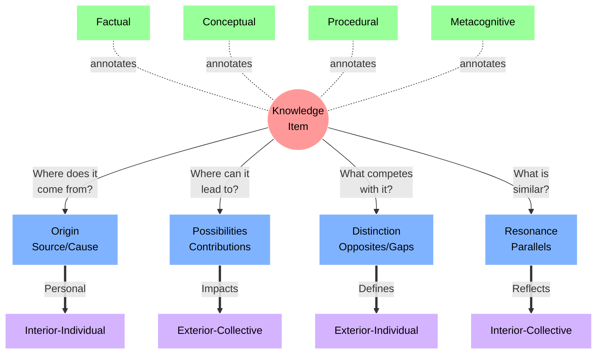

# A Unified Theory of Living Knowledge Management

## The Crisis and Solution

The modern knowledge crisis stems from two fundamental problems:

1. The separation of information from meaning and direction
2. The lack of clear methods for connecting and evolving ideas

Our solution integrates three theoretical frameworks with a directional exploration method to create a living, evolving knowledge system.

## Theoretical Foundations

**1. Base Frameworks**

- **[[Integral Theory]]** (Ken Wilber): Four quadrants of reality
- **Bloom's Taxonomy**: Knowledge classification layers
- **CODE Framework**: Process flow for knowledge management
- **[[Zettelkasten Compass]]**: Powerful annotation method for contextualizing knowledge

**2. Four Vectors of Living Knowledge**
Each vector maps to both a direction and an integral perspective:

## Integration Principles

1. **Directional Force**
   - Each piece of knowledge has inherent directional energy
   - Connections flow along vectors of meaning
   - Ideas evolve through structured exploration
2. **Layered Understanding**
   - Factual: Basic elements and terminology
   - Conceptual: Relationships and patterns
   - Procedural: Methods and applications
   - Metacognitive: Self-reflective awareness

### Exploration Process

For each knowledge item:

1. **Initial Capture**
   - Place item at center
   - Apply relevant knowledge tags
   - Note immediate connections
2. **Vector Exploration**
   - Origin (South): "Where does it come from?"
     - Source context
     - Causal factors
     - Parent categories
   - Possibilities (North): "Where can it lead?"
     - Future applications
     - Potential impacts
     - Child categories
   - Resonance (West): "What is similar?"
     - Pattern matches
     - Cross-disciplinary connections
     - Alternative expressions
   - Distinction (East): "What competes?"
     - Opposites
     - Limitations
     - Enhancement opportunities
3. **Meta Integration**
   - Map to integral perspectives
   - Identify transformative potential
   - Connect to larger patterns
4. **Dynamic Evolution**
   - Each node can become a new center
   - Connections form organically through exploration
   - System grows through use and reflection

## Practical Implementation

1. **Entry Point**
   - Start with any significant idea
   - Place at center of framework
   - Apply initial tags
2. **Exploration**
   - Use directional questions
   - Follow connections
   - Document insights
3. **Integration**
   - Link to existing nodes
   - Map meta relationships
   - Note emerging patterns
4. **Evolution**
   - Revisit and refine
   - Follow new directions
   - Build knowledge networks This unified approach transforms static note-taking into a living system that:
   - Preserves context and meaning
   - Guides structured exploration
   - Enables organic growth
   - Maintains practical utility
   - Supports consciousness evolution The system serves both practical knowledge management and deeper understanding, allowing users to move fluidly between granular information and meta-awareness.
